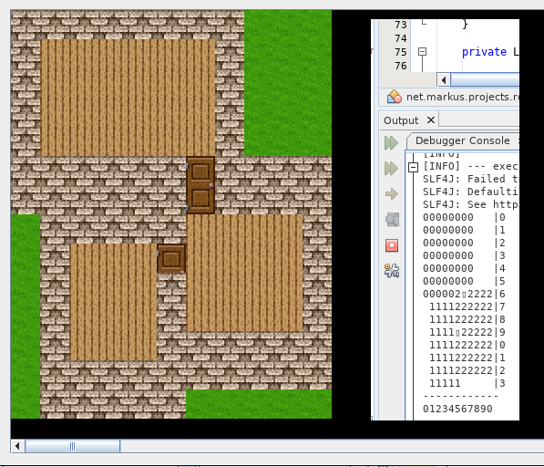

<sub>I used this [font](https://www.fontspace.com/chequered-ink/the-wild-breath-of-zelda) for the logo</sub>

RDF-RPG: A Role-Playing Game (RPG) engine using the Resource Description Framework (RDF).
It is written in Java 8, uses Java Swing to render the game and [Jena](https://jena.apache.org/) for the semantic part.

## Motivation

Today many RPGs have a static world which is designed in a way that the player can
discover it appropriately. But many areas are blocked or doors can not be opened. In short, only the areas the player is meant to explore are modelled for the purpose of the game.
Similarly, nameless Non-Player Characters (NPCs) are only randomly walking "text boxes" repeating
always the same monologues.
I guess, the reason is that manually generated game content is costly.

The research question I questioned myself is: Can we randomly generate and meaningfully simulate a whole city with
NPCs having real names, relationships, knowledge and showing reasonable behavior? Maybe think of [Westworld](https://en.wikipedia.org/wiki/Westworld_(film)).

The idea is to model everything that exists in the game with an [Ontology](https://en.wikipedia.org/wiki/Ontology_(information_science)) using [RDF](https://en.wikipedia.org/wiki/Resource_Description_Framework). Every NPC has an own Knowledge Base - the NPC's brain - storing
facts about the game world and story. The Terminology Box (TBox) contains every class of objects that can exist. Every object in the game world (Assertion Box, ABox) is an instance of a class and has its own identifier and location.

## Random Generation of the Game World

The goal is to automatically and randomly generate a whole city with districts having houses with rooms where families (NPCs) live.

Note: I use the [RPG Maker 2000](https://en.wikipedia.org/wiki/RPG_Maker_2000) chipsets and charsets for rendering the game. The game map is drawn using the [GameMapDrawer](src/main/java/net/markus/projects/rdfrpg/GameMapDrawer.java).

### NPC Inhabitants

In [GenerateGameContent](src/main/java/net/markus/projects/rdfrpg/GenerateGameContent.java) `generate(int maxFamilies)` you can specify the number of families that should live in the city.
We generate for a each family a family tree with the following members:
```
father's father - father's mother     mother's father - mother's mother
                |                                     |
              father                                mother
                 \                                   /
                     0 to 3 {male or female} kid(s)
```
The [NameGenerator](src/main/java/net/markus/projects/rdfrpg/NameGenerator.java) produces english (real world) (female/male) first and common last names. The mother takes always tha fathers family name. We have four age generations: young (6-12), teen (13-25), middle (30-50), old (75-85).
The kid's max age depends on the smallest parent's age substracted by 20 and can be at maximum 25 in order to have at least 20 years between birth giving. A family can have 0 to 3 kids with randomly selected gender. Because also this game has a harsh RPG world some family members are dead: young and teen have 95% survival probability, middle 80% and old 20%, naturally. Based on the age the correct character looking (charset image) is picked. For each living couple and for each kid a bedroom is planned.

A generated example looks like this:
```
<a:Rashida-Jones-48>  a  <t:person> , <t:personLiving> ;
        <t:age>        "48"^^<http://www.w3.org/2001/XMLSchema#int> ;
        <t:agePhase>   <t:personMiddle> ;
        <t:child>      <a:Lupe-Jones-6> , <a:Mitch-Jones-18> ;
        <t:female>     <t:female> ;
        <t:firstname>  "Rashida" ;
        <t:lastname>   "Jones" ;
        <t:parent>     <a:Cletus-Smith-78> , <a:Shela-Smith-84> ;
        <t:partner>    <a:Sean-Jones-47> .

<a:Lupe-Jones-6>  a    <t:personLiving> , <t:person> ;
        <t:age>        "6"^^<http://www.w3.org/2001/XMLSchema#int> ;
        <t:agePhase>   <t:personYoung> ;
        <t:female>     <t:male> ;
        <t:firstname>  "Lupe" ;
        <t:lastname>   "Jones" ;
        <t:parent>     <a:Sean-Jones-47> , <a:Rashida-Jones-48> ;
        <t:sibling>    <a:Mitch-Jones-18> .

<a:Mitch-Jones-18>  a  <t:person> , <t:personLiving> ;
        <t:age>        "18"^^<http://www.w3.org/2001/XMLSchema#int> ;
        <t:agePhase>   <t:personTeen> ;
        <t:female>     <t:male> ;
        <t:firstname>  "Mitch" ;
        <t:lastname>   "Jones" ;
        <t:parent>     <a:Rashida-Jones-48> , <a:Sean-Jones-47> ;
        <t:sibling>    <a:Lupe-Jones-6> .

<a:Cletus-Smith-78>  a  <t:personDead> , <t:person> ;
        <t:age>        "78"^^<http://www.w3.org/2001/XMLSchema#int> ;
        <t:agePhase>   <t:personOld> ;
        <t:child>      <a:Rashida-Jones-48> ;
        <t:female>     <t:male> ;
        <t:firstname>  "Cletus" ;
        <t:lastname>   "Smith" ;
        <t:partner>    <a:Shela-Smith-84> .

<a:Shela-Smith-84>  a  <t:personLiving> , <t:person> ;
        <t:age>        "84"^^<http://www.w3.org/2001/XMLSchema#int> ;
        <t:agePhase>   <t:personOld> ;
        <t:child>      <a:Rashida-Jones-48> ;
        <t:female>     <t:female> ;
        <t:firstname>  "Shela" ;
        <t:lastname>   "Smith" ;
        <t:partner>    <a:Cletus-Smith-78> .

<a:Winfred-Jones-78>  a  <t:personDead> , <t:person> ;
        <t:age>        "78"^^<http://www.w3.org/2001/XMLSchema#int> ;
        <t:agePhase>   <t:personOld> ;
        <t:child>      <a:Sean-Jones-47> ;
        <t:female>     <t:male> ;
        <t:firstname>  "Winfred" ;
        <t:lastname>   "Jones" ;
        <t:partner>    <a:Sherley-Jones-75> .

<a:Sherley-Jones-75>  a  <t:personLiving> , <t:person> ;
        <t:age>        "75"^^<http://www.w3.org/2001/XMLSchema#int> ;
        <t:agePhase>   <t:personOld> ;
        <t:child>      <a:Sean-Jones-47> ;
        <t:female>     <t:female> ;
        <t:firstname>  "Sherley" ;
        <t:lastname>   "Jones" ;
        <t:partner>    <a:Winfred-Jones-78> .

<a:Sean-Jones-47>  a   <t:person> , <t:personLiving> ;
        <t:age>        "47"^^<http://www.w3.org/2001/XMLSchema#int> ;
        <t:agePhase>   <t:personMiddle> ;
        <t:child>      <a:Mitch-Jones-18> , <a:Lupe-Jones-6> ;
        <t:female>     <t:male> ;
        <t:firstname>  "Sean" ;
        <t:lastname>   "Jones" ;
        <t:parent>     <a:Sherley-Jones-75> , <a:Winfred-Jones-78> ;
        <t:partner>    <a:Rashida-Jones-48> .
```

Each NPC has a unique URI and also a distinct RDF graph.
In the RDF graph the whole family tree is stored, which means that the NPC has knowledge about his or her family members.
Other facts about the game world could be added, too.

### Domestic Architecture

A house is usually composed of the following rooms: 1 entrance, 1 kitchen, 1 toilet, *n* bedrooms (depending on living couples, see previouse section), thus *n*+3 rooms.
The house generator code can be found in [RandomRectsGenerator](src/main/java/net/markus/projects/rdfrpg/RandomRectsGenerator.java). The idea behind the algortihm is to randomly grow rectangles until they overlap. Each rectangle is a room. The overlapping points are potential doors. The algortihm checks that all rectangles are reachable, thus no room is separated. There are different ways to create the seed rectangles - the first points that are used to grow to rooms. With the right parameterization we get very different but valid house contours.



### Interior Furnishing

The furnishing is based on the previous random rectangle generation (see [InteriorFurnishing](src/main/java/net/markus/projects/rdfrpg/InteriorFurnishing.java)). The [GameMap](src/main/java/net/markus/projects/rdfrpg/GameMap.java) is used to draw tiles to a map. For each rectangle the room's wall, floor and doors are put into the map. We sort the rooms descending by size and assign types as follows (There are special exceptions if only 3 or less rooms exist):
* Biggest room is always the entrance.
* Second biggest room is always the kitchen.
* Smallest room is always toilet.
* The remaining rooms are bedrooms.

The entrance door for the entrance room is randomly selected from possible valid fields.
These are all wall tiles which do not lead to another room, i.e. lead to the outside.

Before explaining the furnishing some words about the Terminology Box (TBox) which defines
what can be exist in the game world (ontology).
Every thing is a RDF Class with a unique URI, an explaining comment and from which
image it can be loaded (usually called sprite or tile). An example (full file at [t.ttl](src/main/resources/t.ttl)):
```
t:lamp rdfs:subClassOf t:chip, t:light ;
    rdfs:comment "a device for giving light." ;
    t:resource <res:/chipset/Ship.png> ;
    t:resourceLocation "29,3" .

t:vaseLarge rdfs:subClassOf t:chip ;
    rdfs:comment "a decorative container without handles." ;
    t:resource <res:/chipset/Basis.png> ;
    t:resourceLocation "25,10" .

t:stool rdfs:subClassOf t:chip, t:seat;
    rdfs:comment "a seat without a back or arms." ;
    t:resource <res:/chipset/Basis.png> ;
    t:resourceLocation "26,11" .
```

The actual furnishing is realized with room configurations. The room config for a
room type (entrance, kitchen, bedroom, toilet) decides which things are
mandatory or optional in the room. A configuration refers to a thing by its URI. Mandatory objects are things which are features of the room, e.g. a kitchen is a kitchen if it contains an oven while a bedroom is a bedroom if it
contains a bed. Mandatory things are only once added to the room.
Optional things are placed randomly multiple times in the room but infrequent ones (not already placed ones) are preferred.
When the occupied rate (number of occupied fields / number of free fields) is greater than 25% the optional furnishing is stopped.
For each placement it is checked if the object is reachable starting from the entrance door. This ensures that the characters can move to all objects and no object is blocking (e.g. by placing it in front of a door).
Some objects have special constraints: They must be near the wall (e.g. `t:mustWallUp` or they hover instead of lying on the ground. The algorithm ensures that only valid fields are used. See for example a picture:
```
t:pictureLandscape rdfs:subClassOf t:chip, t:decoration, t:hovering, t:mustWallUp ;
    rdfs:comment "a painting or drawing." ;
    t:resource <res:/chipset/Basis.png> ;
    t:resourceLocation "24,5" .
```

Currently, the following room configs are made:
```
t:roomEntrance rdfs:subClassOf t:room ;
    t:mandatory t:clock ;
    t:optional
        t:picture ,
        t:flowerVase ,
        t:flowerVaseRed ,
        t:candlestick ,
        t:vaseLarge ,
        t:crate .

t:roomKitchen rdfs:subClassOf t:room ;
    t:mandatory t:oven , t:table ;
    t:optional
        t:stool ,
        t:picture ,
        t:cupboard,
        t:shelf ,
        t:table ,
        t:crate ,
        t:barrel ,
        t:bag .

t:roomBedroom rdfs:subClassOf t:room ;
    t:mandatory t:bed , t:cupboard ;
    t:optional
        t:picture ,
        t:cupboard ,
        t:mirror ,
        t:shelf ,
        t:table ,
        t:chestWood ,
        t:chestRed .

t:roomToilet rdfs:subClassOf t:room ;
    t:mandatory t:toilet , t:washbasinWithMirror ;
    t:optional
        t:bathtubEmpty ,
        t:picture ,
        t:shelf ,
        t:bucketWood,
        t:cupboard ,
        t:stool .
```

An older example for a furnished house:


Because for each living couple and for each kid a bedroom was planned we can now put them
into they rooms. A couple share one bed. Another example is this:


### Urban Planning

Having generated families and their furnished houses we need to put them in a city with steets.
We summarize maximal four family houses to a district so that neighborhoods occur.
The algorithm has to make sure that the entrance doors are on the right side so that they
face the street.
If there are no family houses with entrance doors facing up, down, left, right then only horizontal (left,right) or vertical (up,down) districts are formed. The remaining houses are placed as a single districts.


For that we utilize [Rectangle Packing](https://en.wikipedia.org/wiki/Packing_problems#Packing_rectangles).
You find my implementation in [RectBinPack](src/main/java/net/markus/projects/rdfrpg/RectBinPack.java).
Each rectangle is now a district which is surrounded by sidewalk and street.
The idea behind the algorithm is to place the rectangles by descending area size order.
A rectangle is tried to be placed in the city. If this not possible the city's bounding box grows by placing the rectangle on the right or bottom side.
That way, some small rectangles can fill holes.
My first test output with randomly generated rectangles looked like this:


When we do that with the districts of a large city we get the following.
The holes will be filled with steet tiles and create plaza.
Note that the entance doors are always near the sidewalk or have a way to the entrance.


For demonstation we hide higher walls and rooftops. But when the player moves in
the world, we want to hide rooms that can not be visible from the character's perspective.
To make this happen we create for each room a unique URI and store it in the rooms' tiles.
Usually, roof tiles are "paint over" the room unless the player is in the room (set boolean `GameMapDrawer.drawRoof`).
If his character stands *in* the door both rooms are revealed.
See for example the red rectangle in this picture:


### Terrain

In order to finish the game world we have to place the city into a terrain.
Because of the story (see section below) the city needs a city wall and is surrounded by forest.
To have some interaction with water we place the city on the ocean which requires a beach and a
some gras gap.

All public green spaces are filled with trees. Various stones and rocks are placed on non-room free fields
on the map. The size of the terrain grows with the city size. Here a finished game map with 25 families:


## Game Engine

Now, we have a generated game world with NPCs living in their houses.
The game engine "animates" the world by passing time and moving NPCs.

### Time

I would like to have a passing time in the game, so that NPCs can behave according to the current time.
In [Game](src/main/java/net/markus/projects/rdfrpg/Game.java) the engine stores the in-game time.
We calculate in time units (using an integer) and convert from and to our time format.
In order to know when a day is over, the number of time units for a day is hardcoded set.
A java.util.Timer ticks and increases a time unit.

#### Sunrise & Sunset

Because we have a time concept, we can simulate sunrise, sunset and night.
This is accomplished by dyed chipset images based on the time.
You find the code in [GameMapDrawer](src/main/java/net/markus/projects/rdfrpg/GameMapDrawer.java).

**Sunrise** is starting at 5:00 with the morning sun and normalizes from 6:00 to day light.


**Sunset** is starting at 19:00 until it's dark at 20:00.


So it's night from 20:00 to 5:00.

### NPC Day Routine

When we have time running we can animate the NPCs according to time.
The idea is that NPCs have a fixed day routine in their mind (their knowledge base using RDF) based on their age and job.
A lumberjack day routine could look like this:

    0 - 6 sleep (find your bed, go to bed, sleep)
    6 - 7 eat (find kitchen, go randomly to kitchen objects)
    7 - 11 cut tree (find next tree, go to tree, cut)
    11 - 12 eat (find kitchen, go randomly to kitchen objects)
    12 - 16 cut tree (find next tree, go to tree, cut)
    16 - 20 inn (go to inn, go randomly to inn objects)
    20 - 6 sleep (find your bed, go to bed, sleep)

The logic for this will be in [NpcManager](src/main/java/net/markus/projects/rdfrpg/NpcManager.java).
The NPC Manager scans the whole map for objects which are non-player character.
For each NPC the routine is picked based on the current time.
Note: This is still TODO. Idea is to have routines with steps, execute the right step for the NPC (e.g. using A*-Algorithm to move to a certain object).

## Game Story

### Prologue

* In the world exits a capital city and smaller villages on one continent
* Many monsters occur and destroy the villages
* Only the capital city still defends its city walls
* After some time, our hero survives as a baby at the city wall while his parents die outside
* The hero is raised in a orphanage until age of 16
* He begins training as city ward to help people and fighting the monsters

### Story

* The hero wears an artifact since being a baby which was given by his parents
* The artifact (a "blueprint") together with items in the city can be used to build a weapon
* The hero searches for those objects while helping people with their problems
* On his adventure he meets the following friends and party members:
    * a bookish male prince from the palace
    * a childish female cook
    * a calm female farmer
    * a rude male lumberjack
    * a tough female merchant

### Ending

* After solving all kinds of quests, the player completes the weapon against the evil
* Final battle: final evil monster wants to destroy the weapon

# TODOs

Still many things to do. If you want to contribute I would be happy. Currently (2019-01-09), I do not have the time.

* Death reason and date for a dead family member
    * natural death: graveyard with name
    * killed by monster: skeleton outside the city, contains a personal item a relative would like to have
* Battle System to fight monsters hiding in rooms or outside the city
* NPC dialog system using question & answering, e.g. "where is your father?", "do you know weakness against <monster>?", "do you have a <item>?", etc.
    * while in dialog time freezes, each question wastes one time unit
    * NPCs can stop dialog if they do not have time for you
* NPC Manager executes day routines, NPCs have different randomly generated day routines
* Special districts: graveyard, school, inn, palace
* Doors, containers and similar things also have a "memory" saving if they are opened or what they contain with RDF triples
* NPCs have "problems" which is why they having quests to solve for the player
    * the quests are also randomly generated and can be dependent on each other
